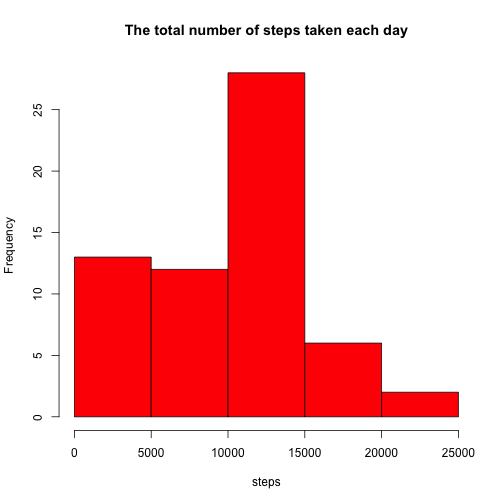
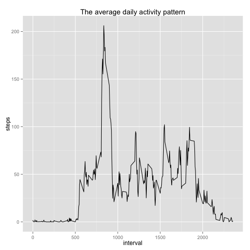
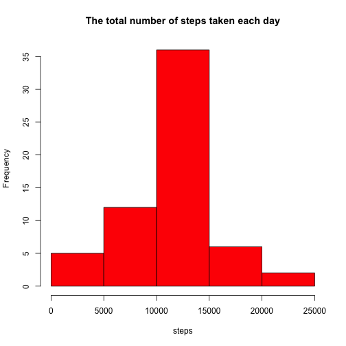
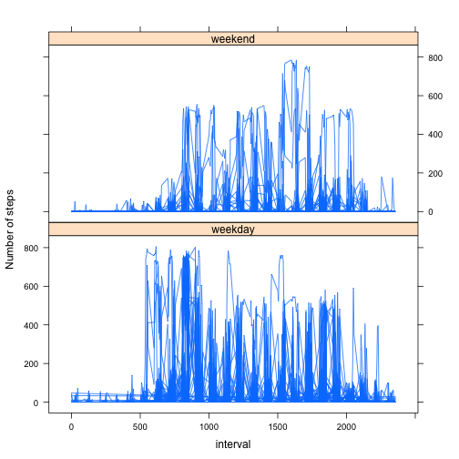

# Reproducible Research: Peer Assessment 1


## Loading and preprocessing the data


```r
library(lattice)
library(ggplot2)

activity <- read.csv("activity.csv")
```


## What is mean total number of steps taken per day?


```r
df <- aggregate(activity$steps, by = list(activity$date), FUN = sum, na.rm = TRUE)
names(df) <- c("date", "steps")

hist(df$steps, main = "The total number of steps taken each day", xlab = "steps", 
    col = "red")
```

 


The mean of total number of steps taken per day:


```r
mean(df$steps)
```

```
## [1] 9354
```


The median of total number of steps taken per day:


```r
median(df$steps)
```

```
## [1] 10395
```


## What is the average daily activity pattern?


```r
df <- aggregate(activity$steps, by = list(activity$interval), FUN = mean, na.rm = TRUE)
names(df) <- c("interval", "steps")

g <- ggplot(df, aes(interval, steps))
g <- g + geom_line()
g <- g + labs(title = "The average daily activity pattern")
g
```

 


The 5-minute interval, on average across all the days in the dataset, contains the maximum number of steps:


```r
df[df$steps == max(df$steps), 1]
```

```
## [1] 835
```


## Imputing missing values

The total number of missing values in the dataset:


```r
sum(is.na(activity$steps))
```

```
## [1] 2304
```


Replace NA values with the mean for that 5-minute interval


```r
df <- aggregate(activity$steps, by = list(activity$interval), FUN = mean, na.rm = TRUE)
names(df) <- c("interval", "steps")
mean_steps <- rep(df$steps, times = 61)

new_activity <- data.frame(steps = activity$steps, date = activity$date, interval = activity$interval)
new_activity$steps[is.na(activity$steps)] <- mean_steps[is.na(activity$steps)]

df <- aggregate(new_activity$steps, by = list(new_activity$date), FUN = sum, 
    na.rm = TRUE)
names(df) <- c("date", "steps")

hist(df$steps, main = "The total number of steps taken each day", xlab = "steps", 
    col = "red")
```

 


The mean of total number of steps taken per day:


```r
mean(df$steps)
```

```
## [1] 10766
```


The median of total number of steps taken per day:


```r
median(df$steps)
```

```
## [1] 10766
```


## Are there differences in activity patterns between weekdays and weekends?


```r
activity$date <- as.Date(as.character(activity$date))
activity$days <- weekdays(activity$date)
activity[activity$days == "Saturday" | activity$days == "Sunday", 4] <- "weekend"
activity[activity$days != "weekend", 4] <- "weekday"

xyplot(steps ~ interval | days, activity, type = "l", layout = c(1, 2), ylab = "Number of steps")
```

 

